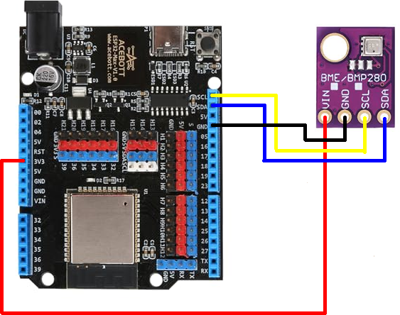

# BME280 Sensor Integration

This document outlines the physical wiring and ESPHome configuration for integrating a BME280 sensor into the Campernet system. The wiring diagram reflects a verified breadboard build and is embedded below.

---

## 📷 Wiring Diagram



All connections are based on real-world prototyping. Wire paths, pin mappings, and board orientation match the diagram exactly.

---

## 🔌 Pin Mapping

| ESP32 Pin | BME280 Pin | Function        |
|-----------|------------|-----------------|
| GPIO 2    | SDA        | I²C data        |
| GPIO 0    | SCL        | I²C clock       |
| 3V3       | VIN        | Power supply    |
| GND       | GND        | Ground          |

No pull-up resistors were required in this build. Behavior may vary by board.

---

## 🧪 ESPHome Configuration

```yaml
sensor:
  - platform: bme280
    temperature:
      name: "Campernet Temperature"
    pressure:
      name: "Campernet Pressure"
    humidity:
      name: "Campernet Humidity"
    i2c_id: bus_a
    address: 0x76
    update_interval: 30s
